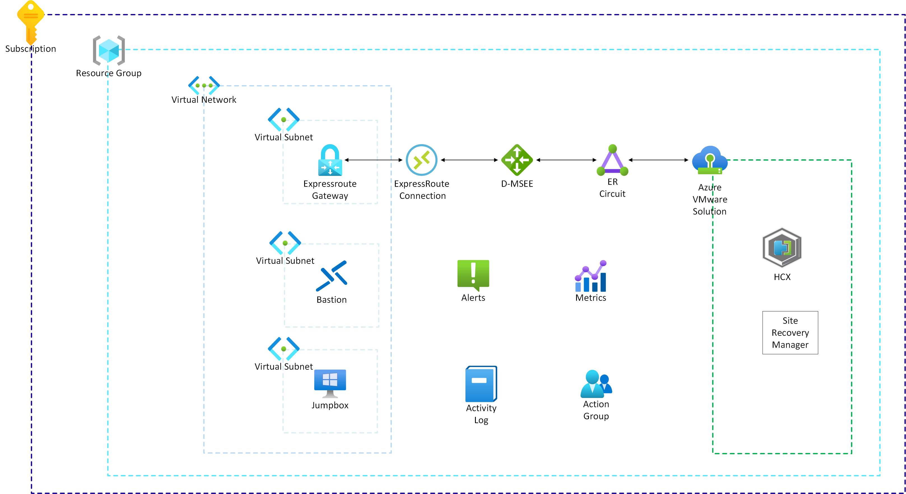

|Greenfield deployment options:          |                           |
|:-------------------------------------|:------------------------: |
|Azure portal UI          |      |
|Command line (Bicep/ARM)              |          |
|Terraform                             |                  |

# AVS Landing Zone: Greenfield Deployment

Greenfield deployment of Azure VMware Solution Landing Zone is suitable for those customers who are looking at brand new installation. By using this reference implementation, these customers can deploy Azure VMware Solution private cloud using suggested configuration from Microsoft. Customers can add new configuration or modify deployed configuration to meet their very specific requirement.

## Prerequisites

To deploy this landing zone, it is recommended that all the instructions from the [Getting Started](../../GettingStarted.md) section are completed.

## What will be deployed?

This reference implementation will deploy full AVS Private Cloud and necessary components to allow for feature add-ins, connectivity and monitoring as per operational best practices. The intention is to deploy this into a new subscription to be considered as the AVS landing zone, adhering to the Azure Landing Zone guidance. However, this can also be deployed to an existing subscription if required.

The following components will be deployed:

| **Resource Type**                      | **Resource Group**     | **Resource Name**         |
| :------------------------------------- | :--------------------- | :------------------------ |
| **AVS Private Cloud**                  | ${Prefix}-PrivateCloud | ${Prefix}-SDDC            |
| **Virtual Network**                    | ${Prefix}-Network      | ${Prefix}-VNet            |
| **Virtual** **Network  Gateway**       | ${Prefix}-Network      | ${Prefix}-GW              |
| **Bastion**                            | ${Prefix}-Jumpbox      | ${Prefix}-bastion         |
| **Jumpbox VM**                         | ${Prefix}-Jumpbox      | ${Prefix}-Jumpbox         |
| **Monitoring**                         | ${Prefix}-Operational  | ${Prefix}-ActionGroup     |
| **Azure NetApp Files VNet**            | ${Prefix}-ANF          | ${Prefix}-ANFVNet         |
| **Azure NetApp Files VNet Gateway**    | ${prefix}-ANF          | ${Prefix}-ANFVNetGW       |
| **Azure NetApp Files account**         | ${Prefix}-ANF          | ${Prefix}-ANFaccount      |
| **Azure NetApp Files capacity pool**   | ${Prefix}-ANF          | ${Prefix}-ANFcapacitypool |
| **Azure NetApp Files volume**          | ${Prefix}-ANF          | ${Prefix}-ANFdatastore01  |
| **Azure NetApp Files datastore**       | ${Prefix}-ANF          | ${Prefix}-ANFdatastore01  |

###### Note:  The deployment will ask for a "Prefix" which will be used to name all of the deployed resources. The naming of resources is hard coded in the templates, however this can be modified as required prior to deployment.

Each component is discussed in detail below.

### AVS Private Cloud

This is the core component of deployment. AVS Private Cloud consists of one or more clusters. Each cluster contains at least three ESXi hosts/nodes. This deployment create a single private cloud with a single cluster with three nodes. A network address space with non-overlapping IP addresses between on-premise environment, Azure Virtual Network and private cloud needs to be provided at deployment time. Following add-ons are also possible to be deployed at the same time.

- HCX
- SRM

SRM license key and vSphere Replication server count needs to be provided if SRM add-on is selected to deployment. 

### Virtual Network

Virtual Network is used to connect AVS private cloud with Azure. Customer can either choose am existing Azure Virtual Network or create a new Azure Virtual Network. In both cases, it address space for the entire network and "GatewaySubnet" should be provided at the deployment time. If customers use an existing Virtual Network then most likely it will be their Hub Virtual Network.

### Virtual Network Gateway

Virtual Network Gateway is where AVS Private Cloud ExpressRoute connection terminates. This Virtual Network Gateway is of type ExpressRoute. It is recommended to use appropriate SKU to ensure that the throughput of Virtual Network Gateway matches with the AVS Private Cloud ExpressRoute circuit.

### Azure Bastion

Azure Bastion provides secure access to AVS Private Cloud's vCenter, NSX-T and other UI interfaces through a jumpbox VM running in Azure. Azure Bastion needs its own subnet inside Virtual Network. Address space for Azure Bastion subnet should be provided at the deployment time.

### Jumpbox VM

Jumpbox VM provides an easy way to validate and interact with AVS Private Cloud services such as vCenter & NSX-T UI portals. Jumpbox VM username, password, subnet address space and SKU should be provided at the time of deployment. In addition, a bootstrap script can be enabled to preload the Jumpbox VM with necessary applications such as Powershell Core, 7zip, VMware Remote Console (VMRC), etc...

### Monitoring

Reference implementation deploys following components essential for AVS Private Cloud monitoring.

- Metric Alerts: These alerts track important metrics such as CPU, Memory and Storage utilization.
- Activity Log Alerts: These alerts monitor any service health related logs.  

These alerts are sent to Email address(es) provided at the time of deployment.

### Azure NetApp Files VNet (Virtual Network)

Azure NetApp Files VNet (Virtual Network) is used to connect the AVS private cloud to the Azure NetApp Files private endpoints. It is recommended to create a dedicated virtual network connected via ExpressRoute gateway for this purpose.

### Azure NetApp Files VNet (Virtual Network) Gateway

Virtual Network Gateway is where the AVS Private Cloud ExpressRoute connection terminates. This Virtual Network Gateway is of type ExpressRoute. It is recommended to configure the virtual network gateway with the Ultra performance SKU and have FastPath enabled. 

### Azure NetApp Files account

A NetApp account serves as an administrative grouping of the constituent capacity pools. Creating a NetApp account enables you to set up a capacity pool and subsequently create a volume.

### Azure NetApp Files capacity pool

Creating a capacity pool enables you to create volumes within it. For Azure NetApp Files datastore it is recommmended to create a capacity pool using the 'Ultra storage' service level.

### Azure NetApp Files volume

An Azure NetApp Files volume provides the backing storage for the Azure NetApp Files datastore.

### Azure NetApp Files datastore

Azure VMware Solution supports attaching network file system (NFS) datastores as a persistent storage option. You can create NFS datastores with Azure NetApp Files volumes and attach them to clusters of your choice. By using NFS datastores backed by Azure NetApp Files, you can expand your storage instead of scaling the clusters.

## How to deploy this reference implementation

We have a few options available to deploy this AVS Landing zone:

- [ARM (Portal)](https://portal.azure.com/#blade/Microsoft_Azure_CreateUIDef/CustomDeploymentBlade/uri/https%3A%2F%2Fraw.githubusercontent.com%2FAzure%2FEnterprise-Scale-for-AVS%2Fmain%2FAVS-Landing-Zone%2FGreenField%2FPortalUI%2FARM%2FESLZDeploy.deploy.json/uiFormDefinitionUri/https%3A%2F%2Fraw.githubusercontent.com%2FAzure%2FEnterprise-Scale-for-AVS%2Fmain%2FAVS-Landing-Zone%2FGreenField%2FPortalUI%2FARM%2FESLZdeploy.PortalUI.json)
- [ARM (Template)](ARM)
- [Bicep](Bicep)
- [Terraform](Terraform)
